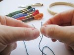
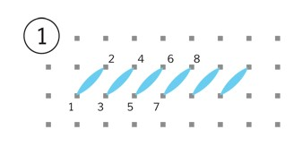
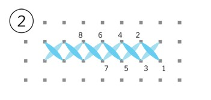

 

# How to Cross-Stitch

Cross-stitching is a type of needlework. It is a simple hand embroidery named for its X-shaped stitches. The stitches are on Aida. Aida is a specific material that has small holes in the fabric. Many people begin the activity because it is easy to master.

### WARNING: Sharp needles may cause harm to the user. Please have adult supervision.

## Required Materials

- Cross-stitch needle

- Aida fabric 

   > Note: There are different sizes of Aida. Size 14 is standard for beginners. Higher numbers will create a smaller pattern.

- Embroidery thread

- Embroidery hoop

- Scissors

- Tape

## Steps

1. Tape the edges of the Aida

2. Put the Aida in the hoop

   - Place the Aida fabric between the top and bottom part of the embroidery hoop

   - Tighten the hoop by twisting the knob on the top of the hoop

   - Tightly pull the Aida fabric

     > 

3. Prepare the needle

   - Cut 12 inches of the embroidery thread

   - Separate 2 pieces of the thread

   - Insert the 2 pieces of thread into the needle

   - Create a small knot at the end of the thread

       > Note: There are 6 pieces of thread that make up the embroidery thread. Take 2 of the 6 pieces to use 
       > 
       > 

4. Insert the needle into a hole through the bottom of the fabric 

5. Pull the needle up and through

6. Re-Insert the needle into the hole diagonally to the right through the top

7. Pull the needle down and through

   > The stitch should be one diagonal
   > 
   > 

8. Insert the needle in the hole below the stitch you just made

   > Continue steps 5 - 8 until the length is to satisfaction

9. Pull the needle up and through

10. Insert the needle in the hole diagonally to the left of the hole

11. Pull the needle down and through.

    > This should create the X shape.
    > Continue steps 9 - 11 until you complete each X stitch
    > 

